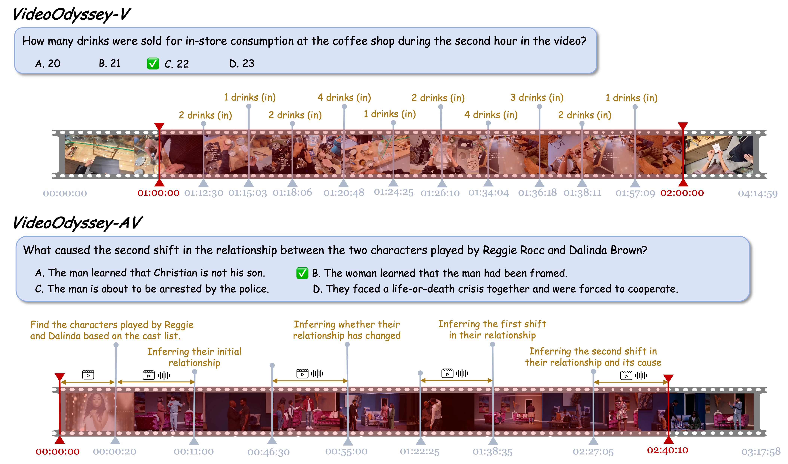
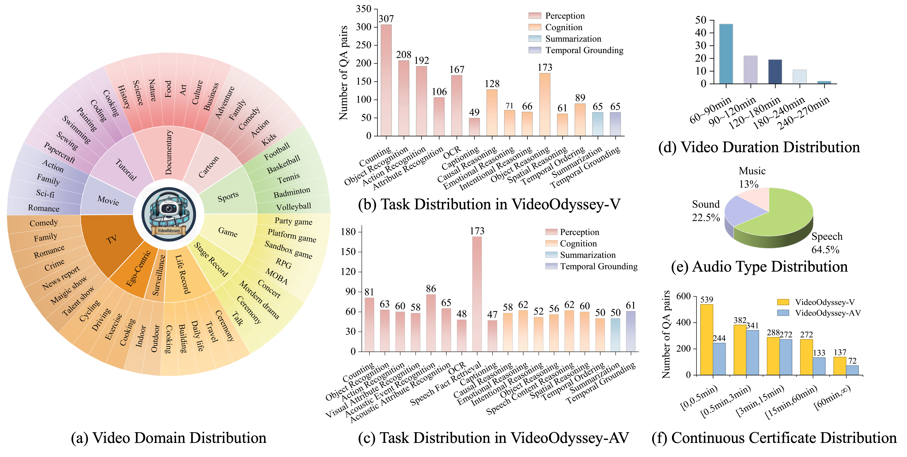
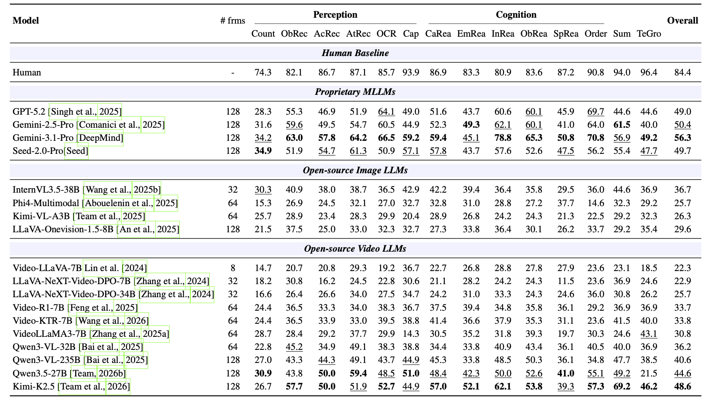
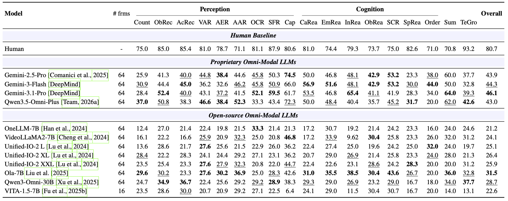
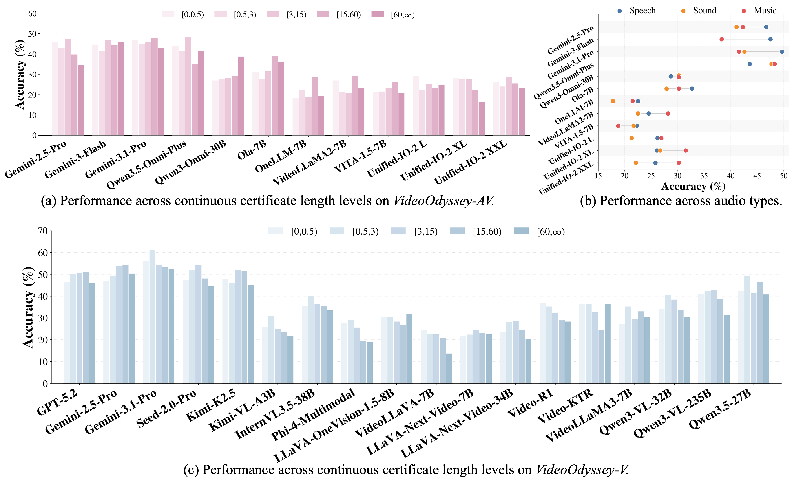

<h1 align="center">VideoOdyssey: A Benchmark for Ultra-Long-Context and Omni-Modal Video Understanding</h1>

<p align="center">
   
   
   
   
  <br>
   
   
   
</p>

<div align="center">
  <font size="4">
    [<a href="https://videoodyssey-project.github.io/">🏠 Project Page</a>] &nbsp;
    [<a href="https://arxiv.org/abs/xxxx.xxxxx">📖 Arxiv Paper</a>] &nbsp;
    [<a href="https://huggingface.co/datasets/maifoundations/VideoOdyssey">🤗 Dataset</a>] &nbsp;
    [<a href="https://videoodyssey-project.github.io/#leaderboard">🏆 Leaderboard</a>]
  </font>
</div>


<br>
<p align="center">
    
</p>


## 🔥 News
* **`2026-05-16`** 🌟 We released VideoOdyssey, a benchmark for ultra-long-context and omni-modal video understanding!


## 👀 VideoOdyssey Overview

[//]: # (Insert a concise version of your abstract here.)
Real-world long video understanding requires models to perform continuous tracking, information integration and memory retention over massive temporal spans within extreme video durations. Mastering this intense cognitive load constitutes the fundamental bottleneck in long video understanding. While existing benchmarks have driven progress by scaling up video duration, their evaluation tasks often require comprehending only short and isolated video segments, falling short of capturing the challenge of ultra-long-context reasoning. To measure this cognitive load, we emphasize **continuous certificate length**, defined as the video length a human must continuously watch to definitively answer a given question. Driven by this metric, we introduce **VideoOdyssey**, a benchmark specifically designed for ultra-long-context and omni-modal video understanding.
<br>
* **Extreme video duration and domain diversity**: We collected **100 ultra-long videos** from public platforms, spanning **11 domains and 54 fine-grained subcategories**. The content ranges from structured narratives (eg., TV, Movie) to unstructured, complex content (eg., Ego-centric videos, Surveillance). The average video duration reaches **109 minutes**. 
* **Comprehensive evaluation scenarios**: We offer two subsets to address different research focuses. **VideoOdyssey-V** probes the limits of pure visual understanding in MLLMs across **14 tasks**. Meanwhile, **VideoOdyssey-AV** evaluates synchronized audio-visual understanding for omni-modal models across **18 tasks**, incorporating **3 audio types**. 
* **Ultra-long and multi-level continuous certificates**: We extend the average continuous certificate length to an unprecedented **16 minutes** for VideoOdyssey-V and **12.8 minutes** for VideoOdyssey-AV. Crucially, we designed 5 granular continuous certificate levels ranging from seconds to hours.

<br>
<p align="center">
    
</p>


## 🔍 Dataset

**License**:
```
VideoOdyssey is under the CC-BY-NC-SA-4.0 license.
VideoOdyssey is only used for academic research. Commercial use in any form is prohibited.
We do not own the copyright of any raw video files. If there is any infringement, please contact us at hehaichen41@gmail.com or zhoujiayi003@gmail.com, we will remove it immediately.
```
You can download the dataset, subtitles, and annotations from [Hugging Face](https://huggingface.co/datasets/your-repo).


## 🔮 Evaluation

Once you have downloaded the datasets, subtitles, and annotations, you can start the evaluation.

### 📍 Prompts
Depending on your evaluation setting, use the following prompt templates:
* **Video only**:
```text
Based on the video only, please answer the question.
You MUST choose the most appropriate answer from the given options (A, B, C, or D).
Even if uncertain, make your best guess. Please directly output the option letter.
Questions: <question_text>
Options: <options_text>
```
* **Video + Subtitles**:
```text
The video's subtitles are listed below and aligned with the sampled video frames in order. Each line is one separate subtitle sentence enclosed in quotes. An empty quoted string means that sampled frame has no subtitle.
<subtitles_text>
Based on the video and subtitles, please answer the question.
You MUST choose the most appropriate answer from the given options (A, B, C, or D).
Even if uncertain, make your best guess. Please directly output the option letter.
Questions: <question_text>
Options: <options_text>
```
* **Video + Audio**:
```text
Based on the video and audio, please answer the question.
You MUST choose the most appropriate answer from the given options (A, B, C, or D).
Even if uncertain, make your best guess. Please directly output the option letter.
Questions: <question_text>
Options: <options_text>
```

### 📍 Use Certificate Window (CW)
By default, we evaluate models under the **w/o CW** setting, which means the complete video is input into the model. 

If you want to evaluate under the **w/ CW** setting, you need to cut the video according to the `time_reference` interval specified for each question. 

### 📍 Example
We provide [run_eval.py](https://github.com/maifoundations/VideoOdyssey/blob/main/scripts/run_eval.py) as an example.

* If you want to test on **VideoOdyssey-V** under the default setting (using `only video` as the input, under `w/o CW` setting), you can run the following code:
```bash
export OPENAI_API_KEY="your_api_key"
export OPENAI_BASE_URL="your_base_url"

python run_eval.py \
    --benchmark videoodyssey-v \
    --annotation path/to/VideoOdyssey_V.json \
    --videos_dir path/to/videos \
    --output_path path/to/output.json \
    --model your-model-name \
    --input v
```
* If you want to test on **VideoOdyssey-AV** under the default setting (using `video + audio` as the input, under `w/o CW` setting), you can run the following code:
```bash
export OPENAI_API_KEY="your_api_key"
export OPENAI_BASE_URL="your_base_url"

python run_eval.py \
    --benchmark videoodyssey-av \
    --annotation path/to/VideoOdyssey_AV.json \
    --videos_dir path/to/videos \
    --output_path path/to/output.json \
    --model your-model-name \
    --input av
```
* If you want to test on **VideoOdyssey-AV** under the using `video + subtitles` as the input, under `w/ CW` setting, you can run the following code:
```bash
export OPENAI_API_KEY="your_api_key"
export OPENAI_BASE_URL="your_base_url"

python run_eval.py \
    --benchmark videoodyssey-v \
    --annotation path/to/VideoOdyssey_V.json \
    --videos_dir path/to/videos \
    --output_path path/to/output.json \
    --model your-model-name \
    --input video_subtitle \
    --subtitle_root path/to/subtitles \
    --use_certificate_window True 
```
### 📍 Getting Evaluation Results

Please format your model's output responses to match our [output_template.json](https://github.com/maifoundations/VideoOdyssey/blob/main/scripts/output_template.json). 

Once formatted, use [test_acc.py](https://github.com/maifoundations/VideoOdyssey/blob/main/scripts/test_acc.py) to generate the final result file. The resulting file will include accuracy across the following dimensions: overall accuracy, accuracy by video domain, accuracy by task type, accuracy by audio type, accuracy by continuous certificate length level, accuracy by video duration.
```bash
python test_acc.py \
    --result-path path/to/your_result.json \
    --benchmark-path path/to/annotation.json
```

### 📍 Leaderboard

If you want to submit your model to our [Leaderboard](https://videoodyssey-project.github.io/#leaderboard), please email your result files to **hehaichen41@gmail.com** or **zhoujiayi003@gmail.com**.


## 📈 Experimental Results

* **Performance across different task types on VideoOdyssey-V**

<p align="center">
    
</p>

* **Performance across different task types on VideoOdyssey-AV**

<p align="center">
    
</p>

* **Performance across different continuous certificate lengths and audio types**

<p align="center">
    
</p>


## :black_nib: Citation

If you find our work helpful, please consider citing our work! ☺️

```bibtex
@article{video_odyssey_2026,
  title={VideoOdyssey: A Benchmark for Ultra-Long-Context and Omni-Modal Video Understanding},
  author={Haichen He and Jiayi Zhou and Sifeng Shang and Yihan Hu and Yuanhan Zhang and Kaiyang Zhou},
  journal={arXiv preprint arXiv:XXXX.XXXXX},
  year={2026}
}
